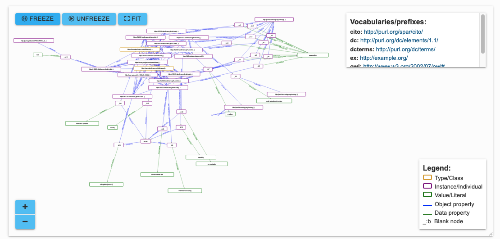

# Relationship Network

This repo contains a download from the GDoc in which the original relationships and terms were collected, 

a notebook to create an overview of these relationships in Turtle 

and the output Turtle. 

When visualising the first 10 relationships the network looks something like this:

